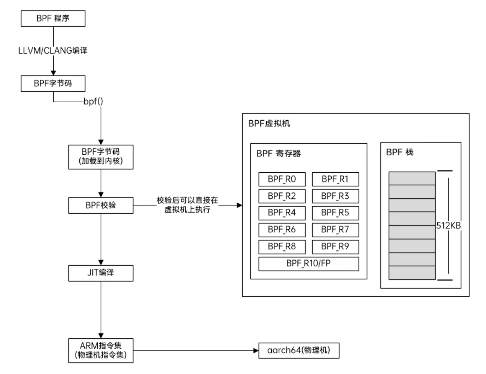
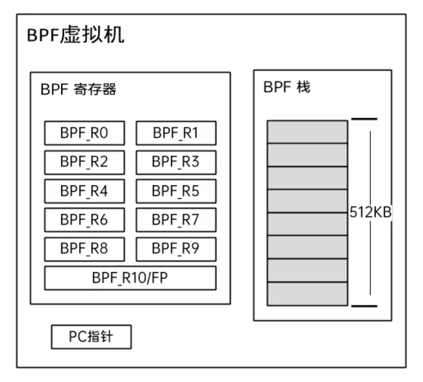

## 一、eBPF 工作原理总览

eBPF，一个源于 Linux 内核的革命性技术，允许我们在内核这个特权环境中安全地运行沙盒程序。值得一提的是，BPF 最初是“伯克利数据包过滤器”的缩写，但如今它的能力已远超网络领域，因此 “BPF” 已成为一个独立术语，而其前身则被称为 **cBPF (classic BPF)**。

eBPF 程序并非直接在 CPU 上运行，而是在一个位于内核中的、高度安全和高效的**BPF 虚拟机** 上执行。我们可以将该虚拟机理解为一个沙盒，确保 eBPF 代码不会导致 kernel panic。


为了让这个虚拟机正常运行，我们需要给它一套指令，这就是 **BPF 指令集**。我们用 C 语言等高级语言写好的逻辑，通过编译器（如 LLVM/Clang）翻译成 BPF 指令集字节码，然后才能交给虚拟机执行。

但光有代码执行是不够的，eBPF 程序经常需要和用户空间程序或者内核的其他部分交换数据，这时就需要用到 **BPF Maps**。这是一种高效的键值对存储，是 eBPF 程序与外界沟通的桥梁。

此外，为了让 eBPF 程序能与内核交互（比如获取当前进程 ID），内核提供了一组固定的**辅助函数 (Helper Functions)**。eBPF 程序只能调用这些预设的、安全的函数，从而在获得强大能力的同时，保证了内核稳定。

最后，编译好的 BPF 字节码在通过 `bpf()` 系统调用加载到内核时，会经过一个严格的**校验器 (Verifier)** 检查，确保代码无害。通过后，字节码可以被**即时编译器 (JIT)** 翻译成原生机器码，以接近本地代码的速度执行。



接下来，我们将逐一拆解这些核心组件。

## 二、BPF 虚拟机与指令集

BPF 程序运行在一个小巧而高效的虚拟机上。这个虚拟机有自己的一套寄存器和指令集，就像一个微型的 CPU。

- **寄存器**: BPF 虚拟机有 11 个 64 位寄存器。
    - `R0` - `R9`: 通用寄存器，用于计算、存储数据和传递参数。
    - `R10`: 只读的帧指针寄存器，用于访问栈空间。



- **指令集**: BPF 指令集中，所有指令都是固定长度的，运行更加简单高效。

### 2.1 指令格式

BPF 指令集官方说明可以参考 Linux 内核文档：[BPF Instruction Set](https://web.git.kernel.org/pub/scm/linux/kernel/git/torvalds/linux.git/tree/Documentation/bpf/standardization/instruction-set.rst)

BPF 指令有两种格式：

1.  **基本指令 (64-bit)**: 这是最常见的格式，由操作码、寄存器、偏移量和立即数组成。所有未使用的字段都必须为零。
    - `opcode`: 8 bit (操作码)
    - `regs`: 8 bit (目标寄存器: 4 bit, 源寄存器: 4 bit)，在大端序和小端序主机上，这两个 4-bit 字段的顺序是相反的。
    - `offset`: 16 bit (偏移量)
    - `imm`: 32 bit (立即数)

2.  **宽指令 (128-bit)**: 专用于加载一个 64 位的立即数 ，(`ld_imm64`)。它由两个连续的 64 位指令构成。
    - 第一个 64 位指令：正常的基本指令格式，其中 imm 字段存放 64 位立即数的低 32 位
    - 第二个 64 位指令：前 32 位（opcode + regs + offset）必须全部为 0，imm 字段存放 64 位立即数的高 32 位

### 2.2 操作码 (Opcode)

`opcode` 决定了一条指令做什么。它的最后 3 位定义了指令的**类别 (Class)**。

| value | class | 描述 |
| :--- | :--- | :--- |
| 0x00 | LD | **加载 (Load)**，非标准加载操作，主要用于 `ld_imm64` 宽指令。 |
| 0x01 | LDX | **加载 (Load)**，从内存读取数据到寄存器。 |
| 0x02 | ST | **存储 (Store)**，将立即数写入内存。 |
| 0x03 | STX | **存储 (Store)**，将寄存器的值写入内存。 |
| 0x04 | ALU | 32位算术与逻辑运算。 |
| 0x05 | JMP | **跳转 (Jump)**，64位操作数的条件或无条件跳转。 |
| 0x06 | JMP32 | **跳转 (Jump)**，32位操作数的条件或无条件跳转。 |
| 0x07 | ALU64 | 64位算术与逻辑运算。 |

### 2.3 存取指令 (LD/LDX, ST/STX)

这类指令负责在寄存器和内存之间搬运数据。它的 `opcode` 除了类别外，还包含了**寻址模式 (Mode)** 和**数据大小 (Size)**。

**寻址模式 (Mode)**

| value | mode modifier | 描述 |
| :--- | :--- | :--- |
| 0 | IMM | **立即数 (Immediate)**，用于 `LDD` 指令加载64位立即数。 |
| 1 | ABS | **绝对寻址 (Absolute)**，用于传统 cBPF，已废弃。 |
| 2 | IND | **间接寻址 (Indirect)**，用于传统 cBPF，已废弃。 |
| 3 | MEM | **常规内存操作 (Memory)**，最常见的加载和存储模式。 |
| 4 | MEMSX | **符号扩展加载 (Sign-extending load)**，加载时将有符号小整数正确扩展到64位。 |
| 6 | ATOMIC | **原子操作 (Atomic)**，用于实现安全的并发数据修改。 |

**数据大小 (Size)**

| value | szie | 描述 |
| :--- | :--- | :--- |
| 0 | W | **字 (Word)**, 4 字节 |
| 1 | H | **半字 (Half-word)**, 2 字节 |
| 2 | B | **字节 (Byte)**, 1 字节 |
| 3 | DW | **双字 (Double-word)**, 8 字节 |

#### 2.3.1 64位立即数加载 (LDD)

`LDD` (Class `0x00`, Mode `0x00`, Size `0x03`) 是一条非常特殊的指令，使用 128 位的宽格式。它不仅能加载一个 64 位的常量，还能通过 `src_reg` 字段的不同取值，实现加载 Map 地址等高级功能，是连接 BPF 程序和外部资源的关键。

| `src_reg` | 伪代码 | `imm` 类型 | 目标寄存器类型 |
| :--- | :--- | :--- | :--- |
| 0x0 | `dst = (next_imm << 32) \| imm` | 整数 | 整数 |
| 0x1 | `dst = map_by_fd(imm)` | Map 文件描述符 | Map 地址 |
| 0x2 | `dst = map_val(map_by_fd(imm)) + next_imm` | Map 文件描述符 | Map 值地址 |
| 0x5 | `dst = map_by_idx(imm)` | Map 程序内索引 | Map 地址 |
| 0x6 | `dst = map_val(map_by_idx(imm)) + next_imm` | Map 程序内索引 | Map 值地址 |

上面的表格就解释了在 BPF C 代码中，表面上直接引用的 Map 变量，在底层是如何通过 `ld_imm64` 指令被解析成实际内存地址的。

#### 2.3.2 常规与符号扩展加载/存储

- **常规加载/存储 (`MEM`)**:
    - `*(size *) (dst_reg + offset) = src_reg`  (STX)
    - `*(size *) (dst_reg + offset) = imm`      (ST)
    - `dst_reg = *(unsigned size *) (src_reg + offset)` (LDX)
- **符号扩展加载 (`MEMSX`)**:
    - `dst_reg = *(signed size *) (src_reg + offset)` (LDX)
    - 用于从内存加载一个有符号的小整数（如 `s8`, `s16`）到 64 位寄存器时，能正确地将符号位扩展到高位，保持数值不变。

#### 2.3.3 原子操作 (Atomic)

原子操作通过 `STX` 指令实现，使用 `ATOMIC` 寻址模式，支持 32 位 (`W`) 和 64 位 (`DW`) 操作。`imm` 字段用于编码具体的操作。

- **简单原子操作**: `imm` 字段的值与算术指令类似。
    - `ADD (0x00)`: `*(size *)(dst + offset) += src`
    - `OR (0x40)`, `AND (0x50)`, `XOR (0xa0)`
- **复杂原子操作**:
    - `XCHG (0xe1)`: 原子地交换 `src` 和 `*(dst + offset)` 的值。
    - `CMPXCHG (0xf1)`: 原子地比较 `*(dst + offset)` 和 `R0`，如果相等，则将 `src` 写入 `*(dst + offset)`。无论如何，都将内存旧值加载回 `R0`。
- **FETCH 修饰符**: 如果 `imm` 中包含 `FETCH (0x01)` 标志，操作会在执行后，将内存中的**旧值**返回到 `src_reg`。`XCHG` 和 `CMPXCHG` 总是隐式包含 `FETCH`。

### 2.4 算术与跳转指令 (ALU/JMP)

这类指令的 `opcode` 除了类别，还包含**操作码 (Code)** 和**源 (Source)**。

**操作数来源 (Source)**

| value | source | 描述 |
| :--- | :--- | :--- |
| 0 | K | 操作数是一个32位立即数 `imm`。 |
| 1 | X | 操作数是另一个寄存器 `src_reg`。 |

#### 2.4.1 算术指令 (ALU/ALU64)

| name | code | 描述与边界情况 |
| :--- | :--- | :--- |
| ADD/SUB | 0x0/0x1 | 加/减法，允许溢出回绕。 |
| MUL/DIV | 0x2/0x3 | 乘/除法。**除以零时，结果为 0**。有符号除法 `SDIV` 中，`LLONG_MIN / -1` 结果仍为 `LLONG_MIN`。 |
| MOD | 0x9 | 取模。**对零取模时，ALU64 下 dst 不变，ALU32 下 dst 高32位清零**。有符号取模 `SMOD` 中，`LLONG_MIN % -1` 结果为 0。 |
| OR/AND/XOR | 0x4/0x5/0xa | 按位或/与/异或。 |
| LSH/RSH | 0x6/0x7 | 逻辑左/右移。移动位数会被 `& 63` (64位) 或 `& 31` (32位) 屏蔽。 |
| ARSH | 0xc | 算术右移（带符号扩展）。 |
| NEG | 0x8 | 取负。 |
| MOV | 0xb | 移动。 |
| MOVSX | 0xb | **符号扩展移动**。从 `src` 移动 `s8`, `s16` 或 `s32` 到 `dst` 并进行符号扩展。 |
| END | 0xd | **字节序转换**。`ALU` 模式下，`source` 位决定是转为小端 (`LE`) 还是大端 (`BE`)。`ALU64` 模式下，进行无条件的大小端翻转 (`bswap`)。`imm` 决定宽度 (16/32/64)。 |

#### 2.4.2 跳转指令 (JMP/JMP32)

| code | value | 描述 |
| :--- | :--- | :--- |
| JA | 0x0 | 无条件跳转。`JMP` 版用 `offset` (16位)，`JMP32` 版用 `imm` (32位)。 |
| JEQ/JNE | 0x1/0x5 | 等于/不等于则跳转。 |
| JGT/JGE | 0x2/0x3 | **无符号**大于/大于等于则跳转。 |
| JLT/JLE | 0xa/0xb | **无符号**小于/小于等于则跳转。 |
| JSGT/JSGE | 0x6/0x7 | **有符号**大于/大于等于则跳转。 |
| JSLT/JSLE | 0xc/0xd | **有符号**小于/小于等于则跳转。 |
| JSET | 0x4 | 按位与结果非零则跳转。 |
| CALL | 0x8 | **函数调用**。这是 eBPF 能力扩展的核心。 |
| EXIT | 0x9 | **程序返回**，终止执行。在子函数中调用则返回到调用点。 |

`CALL` 指令有几种不同的用法，通过 `src_reg` 区分：
- `src_reg = 0`: 调用由 `imm` 指定 ID 的**内核辅助函数**。
- `src_reg = 1`: 调用**程序内本地函数**，`imm` 是相对于当前指令的偏移量。
- `src_reg = 2`: 通过 `imm` 指定的 **BTF ID** 来调用内核辅助函数。

## 三、核心组件：BPF Maps

如果说 BPF 程序是处理数据的“工人”，那 **BPF Maps** 就是工人们存放工具、交换半成品的“仓库”。前面我们已经看到，`LDD` 指令是如何在底层将 Map 翻译成地址的。

BPF Maps 是一种通用的、存在于内核中的键值对存储。它有以下几个关键作用：

1.  **状态保持**: BPF 程序本身是无状态的，一次事件触发执行完所有信息就丢失了。Maps 可以在多次执行之间保存状态，比如，用来统计某个网络包出现的次数。
2.  **内外通信**: 用户空间的控制程序可以通过读写 Maps，向 BPF 程序传递配置，或者从 BPF 程序中获取采集到的数据。
3.  **程序间通信**: 一个 BPF 程序可以将数据写入 Map，另一个 BPF 程序可以从中读取，实现程序间的协作。

内核提供了多种 Map 类型，以适应不同场景，例如：
- `BPF_MAP_TYPE_HASH`: 高效哈希表。
- `BPF_MAP_TYPE_ARRAY`: 高效数组。
- `BPF_MAP_TYPE_PERF_EVENT_ARRAY`: 用于向用户空间发送性能事件数据。
- `BPF_MAP_TYPE_RINGBUF`: 高性能的环形缓冲区，向用户空间传递数据。

## 四、能力扩展：内核辅助函数

为了安全，BPF 虚拟机是一个完全隔离的沙盒，它不能随意调用内核里的任意函数。那它如何与内核交互呢？答案是 **内核辅助函数 (Helper Functions)**。

正如我们在 `CALL` 指令中看到的，BPF 程序可以通过特定指令调用一份内核提供的“白名单”函数。这些函数就是辅助函数，它们是 eBPF 程序能力的源泉，提供了诸如：

- **访问 Maps**: `bpf_map_lookup_elem()`、`bpf_map_update_elem()`
- **获取上下文信息**: `bpf_get_current_pid_tgid()`、`bpf_ktime_get_ns()`
- **网络包处理**: `bpf_skb_store_bytes()`
- **打印调试**: `bpf_printk()`

eBPF 程序只能调用这个固定的函数集合，这既赋予了它强大的能力，也从根本上保证了内核的安全。

## 五、BPF 程序类型

eBPF 程序不是随便挂在内核里就能运行的，它必须附着在内核的特定**挂载点 (Hook Point)** 上。**BPF 程序类型 (Program Type)** 就定义了程序可以挂载在哪里，以及它能做什么。

不同的程序类型，决定了 eBPF 的应用场景。例如：

- **Kprobes / Tracepoints**: 用于内核态函数追踪和性能分析，是可观测性工具（如 `bcc`、`bpftrace`）的根本。
- **XDP (eXpress Data Path)**: 挂载在网卡驱动层，能在网络包进入协议栈前进行处理，实现超高性能的防火墙、负载均衡等。
- **TC (Traffic Control)**: 挂载在内核网络协议栈的队列规则上，用于实现复杂的网络包过滤和流量整形。
- **LSM (Linux Security Modules)**: 用于实现更灵活、更细粒度的安全策略。

程序类型决定了 BPF 程序被调用时，`R1` 寄存器中传入的**上下文 (Context)** 类型（比如对于网络程序是网络包 `sk_buff`），以及它能调用的辅助函数集合。

## 六、编译、加载与校验

正常来说通常使用 C 语言的一个子集来编写 BPF 程序，然后用 `LLVM/Clang` 将其编译成 BPF 字节码。

```bash
clang -O2 -target bpf -c bpf_program.c -o bpf.o
```

编译出的字节码需要通过 `bpf()` 系统调用加载到内核中。现代开发通常使用 `libbpf` 这样的库来简化加载、挂载和与 Maps 交互的过程。

在程序运行前，内核的**校验器 (Verifier)** 会对字节码进行极其严格的静态分析，确保其安全性。校验器是 eBPF 安全模型的基石，它会检查：

1.  **程序必须能终止**: 禁止无限循环，通过有向无环图检查确保程序不会永远执行下去。
2.  **内存访问安全**: 确保不会访问越界的内存地址，不会读取未初始化的栈内存或寄存器。
3.  **类型安全**: 检查函数调用的参数类型是否正确，对上下文的访问是否合规。

只有通过校验的 BPF 程序才被认为是安全的，并被允许加载到内核中。

## 七、执行：解释器与 JIT 编译器

通过校验后，BPF 字节码终于可以执行了。内核提供了两种执行方式：

### 7.1 解释器 (Interpreter)

解释器会逐条读取 BPF 字节码并模拟执行。它非常安全，但效率相对较低，因为每条指令都需要软件模拟。

### 7.2 JIT 编译器 (Just-In-Time)

为了追求极致性能，eBPF 支持**即时编译 (JIT)**。在程序加载时，JIT 编译器会将整个 BPF 字节码动态地翻译成目标机器（如 x86-64, ARM64）的原生指令。

这样，当事件触发 BPF 程序时，CPU 可以直接执行这些编译好的原生指令，省去了逐条解释的开销，从而大大提高了执行效率，性能几乎与原生内核模块无异。

每个支持的 CPU 架构都有自己的 JIT 编译器实现，例如内核源码中的 `bpf_jit_comp.c`。
