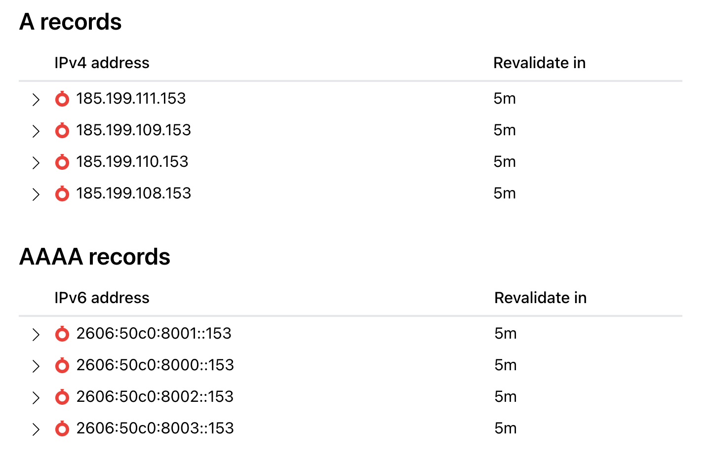
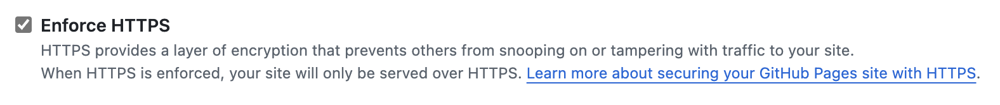

## 问题描述

今天听同学说腾讯云的域名很便宜，十年才 230 CNY，非常心动，遂入手域名 [0b1t.tech](https://0b1t.tech)，买完想把原本托管在 github 上的博客重定向到新的域名上的，没想到迁移出了问题。

一开始都很顺利，但是发现腾讯云自带的 dnspod 服务只能添加两条 DNS 记录，怎么能受这气？直接登上我的 cloudflare，把 DNS 服务改成 cloudflare。没想到就是 cloudflare DNS 默认打开的代理让我折腾了一个晚上。一开始没有发现这个问题，试了 A 记录和 CNAME 记录，结果一直不行，提示

> unavailable for your site because your domain is not properly configured to support https

这不是恶心人吗？https 打勾的框一直都是灰色的，无法勾选，受不了了，到网上去找相似的 issue，还真给我找到了解决方法。

## 解决方案

社区很多讨论中都说要检查下面的几步：

> Check SSL Certificate Installation:
>     Make sure that your SSL certificate is properly installed for the domain. If you're using a certificate provider, ensure that the certificate is correctly configured for your domain and is not expired.
>
> Verify DNS Settings:
>     Confirm that your domain's DNS settings point to the correct server where your site is hosted, and make sure the CNAME or A records are set up correctly.
>     You should also make sure that any DNS propagation has fully completed. DNS changes can take some time (up to 48 hours), so double-check that your records are pointing to the right place.
>
> Check Server Configuration:
>     Ensure that your server is configured to accept HTTPS requests on port 443. Sometimes web servers require specific configuration changes to allow HTTPS traffic. For example, in Apache or Nginx, make sure the SSL configuration in your site’s server block or virtual host is correctly set.
> 
> Redirect HTTP to HTTPS:
>     Add HTTP to HTTPS redirects in your server configuration. This ensures that users who try to visit your site using HTTP will automatically be redirected to the secure HTTPS version of the site.

但是经过我实测，如果你跟着一般教程走的话上面这些问题都不会碰到的，直到我看到下面这个讨论贴：[How to enable https support on custom domains #23049](https://github.com/orgs/community/discussions/23049)，可以看到有很多回复，我一个个翻下去，还真有人提到了 cloudflare proxy 的问题 [“If you're using Cloudflare you need to disable their proxy feature”](https://github.com/orgs/community/discussions/23049#discussioncomment-3573123) 

确实啊，我还没试过关掉 cloudflare 的代理！直接切换到 cloudflare 控制台，把代理关掉，配置如下图

然后我使用[在线 DNS 检查网站](https://www.nslookup.io/)来查看我域名的 DNS，

这不就对味了吗！
再把 github page 在设置页静置一下，没想到过一会儿它自己就跑完了，也能勾选 https 了，好耶！

