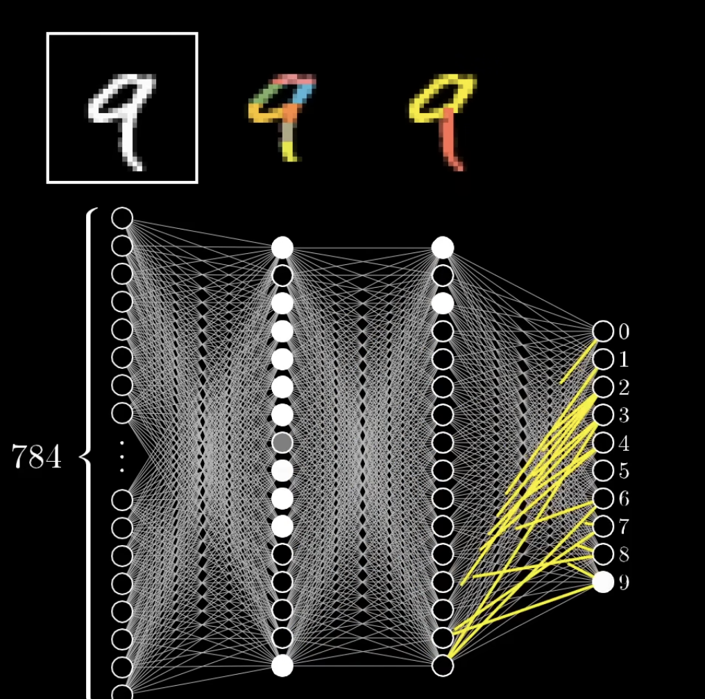
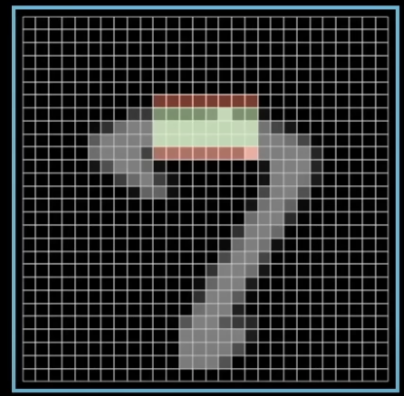
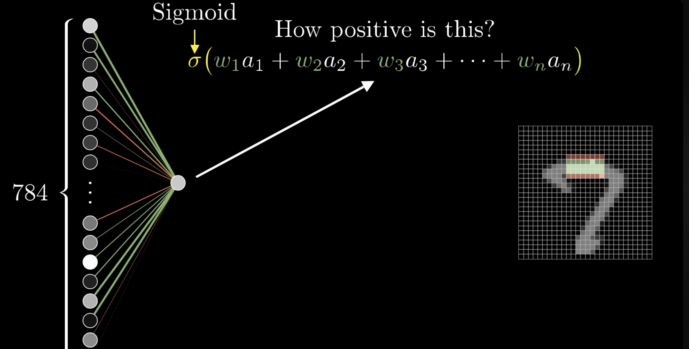
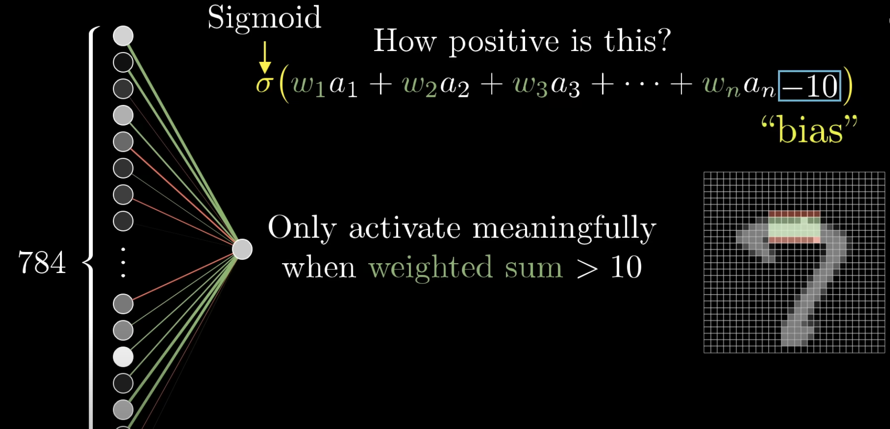
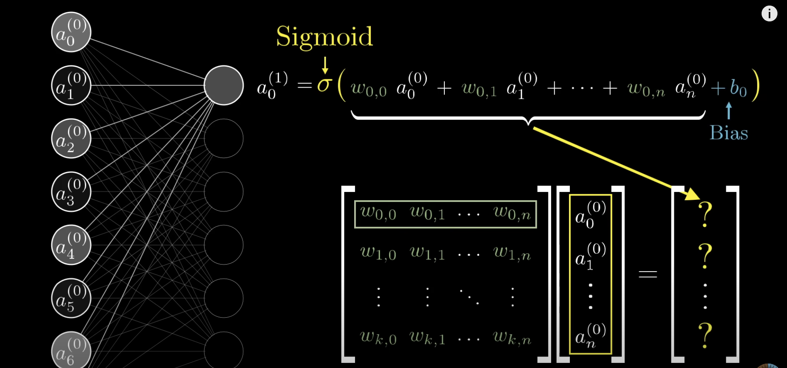
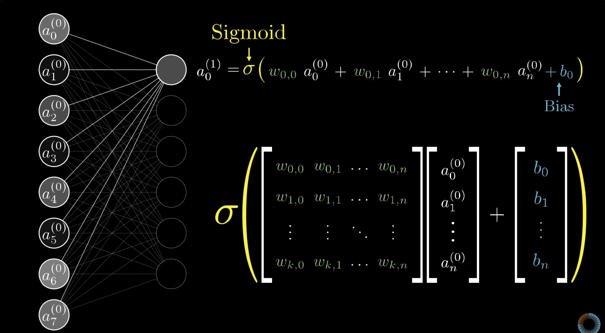
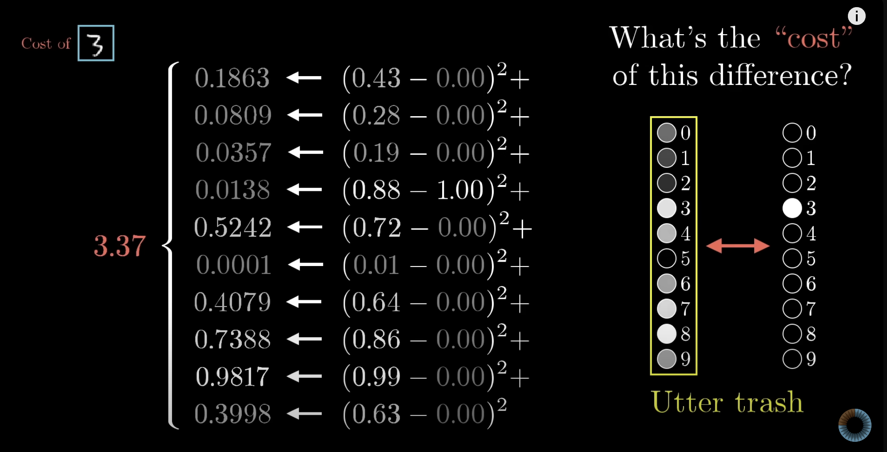
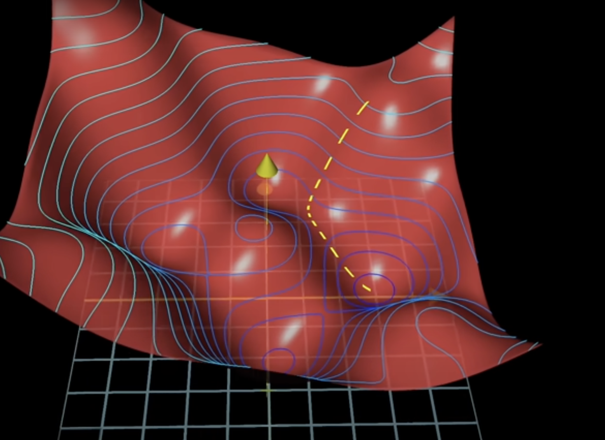
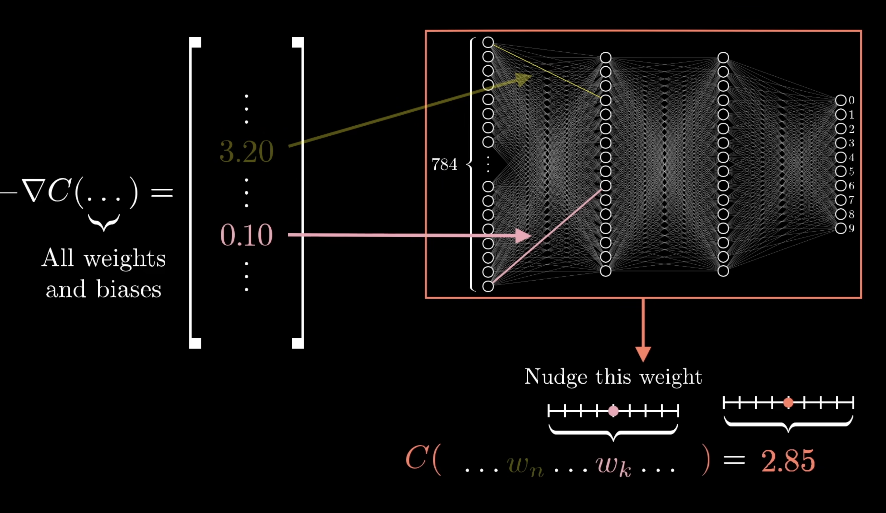
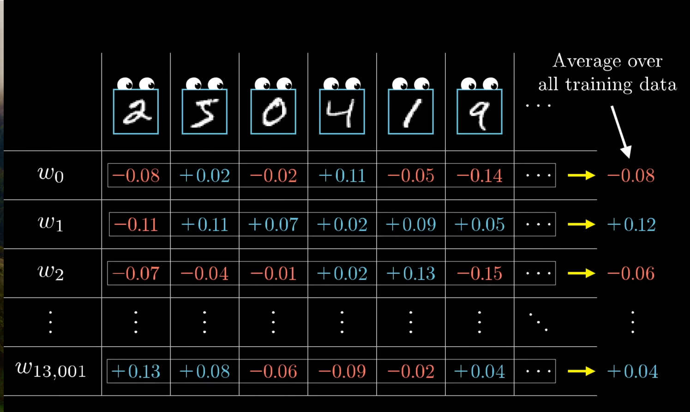

## 神经网络的概念

想象一下，我们想教计算机识别图片中的猫，但是我们不能为它编写一套硬性的规则（“如果它有尖耳朵、胡须和毛茸茸的尾巴，那它就是一只猫”），因为现实世界中的猫品种各异，~~而且猫娘也符合上面的规则~~。

神经网络采用了一种不同的方法：**从样本中学习**。就像我们通过看到真实的各种猫之后才知道这种动物叫“猫”一样，神经网络也会处理成千上万张标记好的图片（“这是猫”，“这不是猫”），并通过这种方法逐渐“学会”识别猫的视觉模式。

从技术上讲，神经网络是一种受人脑结构启发的计算模型。它由许多简单的处理单元——**神经元 (Neuron)**组成，这些神经元组织在不同的**层 (Layer)**中。

一个经典的神经网络有三层：

  - **输入层 (Input Layer)**: 负责接收最原始的数据。例如，对于一张图片，每个神经元可能对应图片中的一个像素值。
  - **隐藏层 (Hidden Layers)**: 位于输入层和输出层之间。这些是网络进行大部分“思考”的地方。一个神经网络可以没有隐藏层，也可以有很多个。层数越多，网络通常越“深”。
  - **输出层 (Output Layer)**: 产生最终的结果。例如，在猫识别任务中，输出层可能只有一个神经元，其输出值在0到1之间，表示图片是猫的概率。



## 前向传播

数据在网络中流动并最终得到一个预测结果的过程就被称为**前向传播 (Forward Propagation)**。

### 神经元和激活值

简单来说，神经元就是持有一个数的简单单元，这个数称为**激活值 (Activation)**。输入层的神经元激活值就是我们输入的数据本身。对于其他层的神经元，它的激活值需要通过计算得出。

### 连接和权重

不同层的神经元之间通过连接进行通信。每个连接都有一个**权重 (Weight)**，这个数代表了连接的强度和重要性。

- 一个较大的正权重意味着前一个神经元的激活会对后一个神经元产生强烈的“兴奋”作用。
- 一个较大的负权重则相反，表示会产生强烈的“抑制”作用。
- 接近于零的权重意味着前一个神经元对后一个神经元几乎没有影响。

**训练神经网络的本质，就是调整这些权重的值。**



### 计算激活值

一个神经元激活值的计算分两步：

- **计算加权和 (Weighted Sum)**: 神经元接收来自前一层所有神经元的输入。它将每个输入的激活值乘以它们之间连接的权重，然后将所有结果相加。

  

  在加权和以外，我们还会加上一个额外的数字，叫做**偏置 (Bias)**。偏置的作用是提供一个可调的“基础激活水平”。你可以把它看作是，在没有任何输入的情况下，一个神经元有多容易被激活。比如，一个高的偏置使得神经元更容易被激活。

  所以，一个神经元的“预激活值”（我们称之为 `z`）的完整公式是：

  $$ z = \sum_{i=1}^{n}(w_i a_i) + bias $$

  ```python
  inputs = [1.0, 2.0, 3.0]
  weights = [0.2, 0.8, -0.5]
  bias = 2.0

  z = inputs[0] * weights[0] + inputs[1] * weights[1] + inputs[2] * weights[2] + bias

  print(z)
  # z = 2.3
  ```

  

- **应用激活函数**: 如果我们只用加权和，那么无论网络有多少层，它本质上都只是在做一个简单的线性变换。这限制了它学习复杂模式的能力。

  为了引入**非线性 (non-linearity)**，我们需要一个**激活函数**。它接收上一步计算出的 `z` 值，并输出最终的激活值 `a`。

  常见的激活函数有很多，这里我们介绍 **ReLU (Rectified Linear Unit，修正线性单元)**。它的规则非常简单：
  - 如果输入 `z` 大于0，输出就是 `z` 本身。
  - 如果输入 `z` 小于或等于0，输出就是0。

  其数学表达式为：

  $$ f(z) = \max(0, z) $$

  ```python
  import numpy as np


  def relu(z):
      return np.maximum(0, z)


  activation = relu(2.3)
  activation_neg = relu(-1.2)
  print(f"ReLU(2.3) = {activation}, ReLU(-1.2) = {activation_neg}")
  # ReLU(2.3) = 2.3, ReLU(-1.2) = 0.0
  ```

  ReLU 之所以受欢迎，是因为它在计算上很高效，并且在实践中能帮助网络更有效地学习。

### 矩阵运算

当神经网络变得很大时，逐个计算每个神经元的加权和会非常慢。幸运的是，我们可以使用线性代数中的矩阵运算来一次性完成一整层神经元的计算。

我们可以把：

- 一层的输入激活值看作一个向量 `A`。
- 连接到下一层的所有权重组织成一个矩阵 `W`。
- 所有偏置组成一个向量 `B`。

那么，下一层所有神经元的预激活值 `Z` 就可以通过一个简单的公式计算出来：

`Z = A · W + B`

其中 `·` 代表点积。

假设我们有一个包含2个样本的批次（batch），每个样本有3个特征（输入），我们要将其传入一个有4个神经元的隐藏层。

- `A` (激活值矩阵) 的形状是 `(2, 3)`
- `W` (权重矩阵) 的形状是 `(3, 4)`
- `B` (偏置向量) 的形状是 `(1, 4)` (它会被广播到 `(2, 4)`)
- `Z` (输出预激活矩阵) 的形状将是 `(2, 4)`

```python
import numpy as np

activations = np.array([[1.0, 2.0, 3.0], [4.0, 5.0, 6.0]])
weights = np.random.rand(3, 4)
print("权重: ", weights)
biases = np.random.rand(1, 4)
print("偏置: ", biases)

Z = np.dot(activations, weights) + biases

print("Z 的形状:", Z.shape)
print("Z 的值:\n", Z)
# 权重:  [[0.08746301 0.34148947 0.2321176  0.49574324]
#  [0.69313075 0.77251665 0.48220435 0.38541945]
#  [0.48551131 0.84943177 0.05167356 0.03890675]]
# 偏置:  [[0.05122642 0.2860902  0.75485931 0.75830747]]
# Z 的形状: (2, 4)
# Z 的值:
#  [[ 2.98148486  4.72090828  2.1064063   2.14160985]
#  [ 6.77980008 10.61122193  4.40439285  4.90181816]]
```

这正是现代深度学习框架 (如 TensorFlow 和 PyTorch)在底层所做的事情，它能极大地利用 GPU 的并行计算能力。

#### 深入理解偏置和广播 (A Deeper Look at Bias and Broadcasting)

在上面 [2.4](#矩阵运算) 节中，你可能会问：“为什么偏置 `B` 的形状是 `(1, 4)`，却能和形状为 `(2, 4)` 的矩阵 `A · W` 相加呢？”

这要归功于 NumPy 的一个强大特性：**广播 (Broadcasting)**。

我们的隐藏层有4个神经元，所以我们有4个对应的偏置值（存储在 `B` 中）。当我们一次性处理一个包含2个样本的批次 (batch)时，这4个偏置值需要被分别应用到**每一个**样本的计算结果上。当 NumPy 看到你要将一个 `(2, 4)` 矩阵和一个 `(1, 4)` 向量相加时，它会自动将这个 `(1, 4)` 的行向量“拉伸”或“复制”成一个 `(2, 4)` 的矩阵，使其形状匹配，然后再执行元素间的加法。NumPy 并不会真的创建这个大矩阵的副本，而是通过一种更巧妙的内部机制来完成计算，节省了大量内存和计算时间。

简单来说，广播机制让我们能用简洁的代码，将同一组偏置高效地应用到一批数据中的所有样本上。

我们可以通过一个具体的代码示例来观察广播是如何工作的: 

```python
import numpy as np

A_dot_W = np.array([[10, 20, 30, 40], [50, 60, 70, 80]])

B = np.array([[0.1, 0.2, 0.3, 0.4]])

print("A · W 的形状:", A_dot_W.shape)
print("B 的形状:", B.shape)

Z = A_dot_W + B

print("\n--- 执行 A_dot_W + B ---")
print("在广播后，B 表现得像下面这个 (2, 4) 的矩阵:")

broadcasted_B_for_demo = np.tile(B, (2, 1))
print(broadcasted_B_for_demo)

print("\n最终结果 Z 的形状:", Z.shape)
print("最终结果 Z 的值:\n", Z)
# A · W 的形状: (2, 4)
# B 的形状: (1, 4)

# --- 执行 A_dot_W + B ---
# 在广播后，B 表现得像下面这个 (2, 4) 的矩阵:
# [[0.1 0.2 0.3 0.4]
#  [0.1 0.2 0.3 0.4]]

# 最终结果 Z 的形状: (2, 4)
# 最终结果 Z 的值:
#  [[10.1 20.2 30.3 40.4]
#  [50.1 60.2 70.3 80.4]]
```
我们可以清晰地看到 `B` 是如何被“拉伸”以匹配 `A_dot_W` 的形状，从而完成加法运算的。




## 训练过程

我们已经知道数据是如何在网络中流动的 (前向传播)，但网络是如何“学习”——也就是如何找到正确的权重和偏置的呢？这个过程叫做**训练 (Training)**。

训练就像一个反馈循环：

- **预测**：让网络根据当前的权重和偏置进行一次前向传播，得到一个预测结果。
- **评估**：将预测结果与真实的答案进行比较，计算出“误差”有多大。
- **学习**：根据误差，反向调整网络中的所有权重和偏置，目标是让下一次的误差变得更小。

### 损失函数

为了评估网络的表现，我们需要一个**损失函数 (Loss Function)**。这会量化预测值和真实值之间的差距。

一个常用的损失函数是**均方误差 (Mean Squared Error, MSE)**：
- 计算每个输出神经元的预测值与真实值之差。
- 将这个差值平方（这样可以确保结果是正数，并且对较大的误差给予更大的“惩罚”）。
- 将所有输出神经元的平方差加起来，并取平均值。

即 `loss = mean((pred - true)²)`

其数学公式为 ($k$ 是输出神经元的数量):

$$ C = \frac{1}{m} \sum_{i=1}^{m} \sum_{j=1}^{k} (y_{pred, ij} - y_{true, ij})^2 $$

用代码实现：
```python
import numpy as np

y_true = np.array([[0, 1], [1, 0]])
y_pred = np.array([[0.1, 0.9], [0.8, 0.2]])


def mse_loss(y_true, y_pred):
    return np.mean((y_pred - y_true) ** 2)


loss = mse_loss(y_true, y_pred)

print("loss = ", loss)
# loss = 0.024999999999999994
```

我们的目标就是通过调整权重和偏置，让这个损失值**尽可能小**。



### 梯度下降

想象一下，你正站在一座大山 (损失函数) 上，蒙着眼睛，你的目标是走到山谷的最低点 (最小损失)。你会怎么做？
你可能会伸出脚，感受一下哪个方向是下坡最陡峭的，然后朝那个方向迈一小步。重复这个过程，你最终会到达谷底。

这就是**梯度下降 (Gradient Descent)**算法的核心思想。

- **梯度 (Gradient)**在数学上指向了函数值增长最快的方向(也就是上坡最陡的方向)。
- 因此，我们只需要沿着**负梯度**(梯度的反方向)前进，就能最快地降低损失值。
  

我们还需要一个**学习率 (Learning Rate)**，它决定了我们沿着下坡方向“迈出的步子有多大”。

- **学习率太小**：下山速度会非常慢。
- **学习率太大**：我们可能会在谷底来回“跨过”，永远无法到达最低点。

选择一个合适的学习率是训练神经网络中的一个重要技巧。

参数更新的规则可以表示为：
$$ w_{new} = w_{old} - \eta \frac{\partial C}{\partial w} $$
其中 `η` 是学习率，`∂C/∂w` 是损失对权重 `w` 的梯度。

### 反向传播

梯度下降告诉了我们要下山，但没有告诉我们网络中成千上万个权重和偏置具体要如何改变才能实现下山。

**反向传播 (Backpropagation)**就是解决这个问题的算法。它的核心思想是“分配责任”。

在一次预测后，我们得到了总的误差。反向传播会从输出层开始，反向地通过网络，计算出每个权重和偏置对这个总误差“贡献”了多少责任。

这个过程依赖于微积分中的**链式法则**。我们想知道改变一个权重 `w` 会如何影响最终的损失 `C` (即梯度 `∂C/∂w`)。这个梯度可以被分解为几个部分的乘积：

$$ \frac{\partial C}{\partial w} = \frac{\partial C}{\partial a} \times \frac{\partial a}{\partial z} \times \frac{\partial z}{\partial w} $$

下面我们将拆解这个公式，把它想象成一个“责任追踪”的过程。我们的目标 `∂C/∂w` 是要算出权重 `w` 应该为最终的误差 `C` 负多少责任。

链式法则告诉我们，这个总责任可以分解为一连串局部责任的乘积：

1.  **`∂z/∂w`：权重 `w` 对神经元输入 `z` 的责任。**
    - 回顾公式 `z = w * a_prev + ...`，`w` 的影响大小，完全取决于它所乘的那个输入值 `a_prev`。如果 `a_prev` 很大，`w` 的一点小变化就会被放大；如果 `a_prev` 是0，`w` 再怎么变也影响不了 `z`。**所以，这部分的责任就是 `a_prev`。**

2.  **`∂a/∂z`：神经元输入 `z` 对其输出 `a` 的责任。**
    - 对于ReLU函数，如果 `z` 本来就大于0，那 `z` 的变化会直接通过，责任是1。如果 `z` 小于等于0，那 `z` 再怎么变，输出 `a` 都是0，没有变化，那么责任是0。**所以，这部分的责任是激活函数的导数，它决定了梯度能否继续向后流动。**

3.  **`∂C/∂a`：神经元输出 `a` 对最终总误差 `C` 的责任。**
    - 这是最关键的一步，也是“反向传播”中“传播”的体现。一个神经元的输出 `a` 会影响到下一层所有与它相连的神经元，进而通过整个网络，最终影响到总误差 `C`。我们无法直接计算这个责任。**所以，这个责任值必须从下一层“传播”回来。** 它代表了所有来自“前方”（更靠近输出层）的误差信号汇集到 `a` 这一点上的总和。

综上，为了计算一个权重的梯度（`∂C/∂w`），我们把这三份“责任”相乘：(来自前一层的输入 `a_prev`) × (激活函数的导数) × (从后一层传回来的误差)。这就是反向传播的核心计算。



- **对于输出层的权重**：它们对误差的贡献比较直接，可以相对容易地计算出来。
- **对于隐藏层的权重**：它们对误差的贡献是间接的，通过影响下一层的神经元来实现。反向传播算法会把下一层计算出的“误差信号”传播回来，并根据连接的权重进行分配。

最终，我们会得到网络中**每一个**权重和偏置的梯度。这个梯度告诉我们，为了降低损失，这个参数应该增加还是减少，以及改变的幅度。



### 总结训练循环

于是，我们可以完整地描述训练过程了，这个过程会重复很多次 (称为 **Epochs**):

1.  **前向传播**：将一批训练数据输入网络，计算出预测值。
2.  **计算损失**：使用损失函数，比较预测值和真实值，得到损失。
3.  **反向传播**：从损失出发，反向计算出网络中每个权重和偏置的梯度。
4.  **更新参数**：使用梯度下降，根据梯度和学习率，对所有权重和偏置进行一次微小的更新。

经过成千上万次的迭代，网络的权重和偏置会逐渐收敛到一组能够很好地完成任务的值。网络就“学会”了辨认猫猫。

## 一个简单的 Python 实现

下面是一个用 Python 和 NumPy 从零开始实现的简单神经网络。

```python
import numpy as np


class Neuron:
    """
    单个神经元。管理自己的权重、偏置，并执行前向和后向计算。
    """

    def __init__(self, num_inputs):
        # 随机初始化权重，乘以一个小数以防止初始值过大
        self.weights = np.random.randn(num_inputs, 1) * 0.01
        # 初始化偏置为0
        self.bias = np.zeros((1, 1))
        # 存储计算过程中的中间值，用于反向传播
        self.last_input = None
        self.last_z = None

    def relu(self, z):
        """ReLU 激活函数"""
        return np.maximum(0, z)

    def relu_derivative(self, z):
        """ReLU 激活函数的导数"""
        return np.where(z > 0, 1, 0)

    def forward(self, activations):
        """
        执行前向传播：z = a * w + b, a_out = relu(z)
        """
        self.last_input = activations
        # 计算加权和 z
        z = np.dot(activations, self.weights) + self.bias
        self.last_z = z
        # 应用激活函数
        return self.relu(z)

    def backward(self, dC_da, learning_rate):
        """
        执行反向传播，计算并应用梯度。
        dC_da: 损失函数对本神经元输出 a 的梯度 (从下一层传来)
        """
        # 1. 计算 da/dz (激活函数对z的梯度)
        da_dz = self.relu_derivative(self.last_z)

        # 2. 计算 dC/dz (损失对z的梯度) = dC/da * da/dz
        dC_dz = dC_da * da_dz

        # 3. 计算 dC/dw (损失对权重的梯度) = dC/dz * dz/dw
        #    dz/dw = last_input, 所以 dC/dw = last_input.T * dC/dz
        dC_dw = np.dot(self.last_input.T, dC_dz)

        # 4. 计算 dC/db (损失对偏置的梯度) = dC/dz * dz/db
        #    dz/db = 1, 所以 dC/db = dC/dz
        dC_db = np.sum(dC_dz, axis=0, keepdims=True)

        # 5. 计算 dC/da_prev (损失对前一层激活值的梯度)，用于传给前一层
        #    dC/da_prev = dC/dz * dz/da_prev
        #    dz/da_prev = weights, 所以 dC/da_prev = dC/dz * weights.T
        dC_da_prev = np.dot(dC_dz, self.weights.T)

        # 6. 根据梯度更新权重和偏置
        self.weights -= learning_rate * dC_dw
        self.bias -= learning_rate * dC_db

        # 返回 dC/da_prev，传递给前一层继续反向传播
        return dC_da_prev


class Layer:
    """
    一层神经元。
    """

    def __init__(self, num_neurons, num_inputs_per_neuron):
        self.neurons = [Neuron(num_inputs_per_neuron) for _ in range(num_neurons)]

    def forward(self, activations):
        """对层中所有神经元执行前向传播"""
        # hstack 用于水平堆叠输出，形成一个 (batch_size, num_neurons) 的矩阵
        return np.hstack([neuron.forward(activations) for neuron in self.neurons])

    def backward(self, dC_da, learning_rate):
        """对层中所有神经元执行反向传播"""
        # dC_da 的形状是 (batch_size, num_neurons)
        # 我们需要为每个神经元传入对应的梯度 dC_da[:, [i]]
        # 然后将所有神经元返回的 dC/da_prev 相加，得到传给前一层的总梯度
        return np.sum(
            [
                neuron.backward(dC_da[:, [i]], learning_rate)
                for i, neuron in enumerate(self.neurons)
            ],
            axis=0,
        )


class NeuralNetwork:
    """
    完整的神经网络模型。
    """

    def __init__(self, layer_sizes):
        # layer_sizes 是一个列表，例如 [784, 128, 10]
        # 表示输入层784个节点，隐藏层128个，输出层10个
        self.layers = []
        for i in range(len(layer_sizes) - 1):
            self.layers.append(Layer(layer_sizes[i + 1], layer_sizes[i]))

    def forward(self, activations):
        """对所有层执行前向传播"""
        for layer in self.layers:
            activations = layer.forward(activations)
        return activations

    def mse_loss(self, y_true, y_pred):
        """均方误差损失函数"""
        return np.mean((y_pred - y_true) ** 2)

    def derivative_mse_loss(self, y_true, y_pred):
        """均方误差损失函数的导数"""
        return 2 * (y_pred - y_true) / y_true.shape[0]

    def train(self, X, y, epochs, learning_rate, batch_size=32):
        """训练神经网络"""
        for epoch in range(epochs):
            total_loss = 0
            # 使用小批量梯度下降
            for i in range(0, len(X), batch_size):
                X_batch = X[i : i + batch_size]
                y_batch = y[i : i + batch_size]

                # 1. 前向传播
                outputs = self.forward(X_batch)

                # 2. 计算损失
                loss = self.mse_loss(y_batch, outputs)
                total_loss += loss * len(X_batch)

                # 3. 计算输出层的梯度
                output_gradient = self.derivative_mse_loss(y_batch, outputs)

                # 4. 反向传播
                for layer in reversed(self.layers):
                    output_gradient = layer.backward(output_gradient, learning_rate)

            avg_loss = total_loss / len(X)
            print(f"Epoch {epoch+1}/{epochs}, Loss: {avg_loss:.6f}")

    def predict(self, X):
        """用训练好的网络进行预测"""
        return self.forward(X)
```
