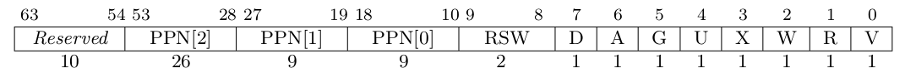

## 本章任务

- `make test BASE=1`
- 理解 vm.c 中的几个函数的大致功能，通过 `bin_loader` 理解当前用户程序的虚存布局。
- 结合课堂内容，完成本章问答作业。
- 完成本章编程作业。
- 最终，完成实验报告并 push 你的 ch4 分支到远程仓库。

## 编程作业

### 重新实现 sys_gettimeofday 以及 sys_trace

引入虚存机制后，原来内核的 `sys_gettimeofday` 和 `sys_trace` 函数实现就无效了。 请你重写这两个系统调用的代码，恢复其正常功能。

此外，由于本章我们有了地址空间作为隔离机制，所以 `sys_trace` 需要考虑一些额外的情况：

- 在读取（`trace_request` 为 0）时，如果对应地址用户不可见或不可读，则返回值应为 -1（`int` 的 -1，而非 `uint8_t`）。
- 在写入（`trace_request` 为 1）时，如果对应地址用户不可见或不可写，则返回值应为 -1（`int` 的 -1，而非 `uint8_t`）。

### mmap 匿名映射

`mmap` 在 Linux 中主要用于在内存中映射文件，本次实验简化它的功能，仅使用匿名映射来申请内存。

请实现 `mmap` 和 `munmap` 系统调用，`mmap` 定义如下：

`int mmap(void* start, unsigned long long len, int prot, int flags)`

- syscall ID：222
- 功能：申请长度为 `len` 字节的匿名物理内存（不要求实际物理内存位置，可以随便找一块），并映射到 `addr` 开始的虚拟地址，内存页属性为 `prot`。
- 参数：
    - `start`：需要映射的虚存起始地址。
    - `len`：映射字节长度，可以为 0。
    - `prot`：第 0 位表示是否可读，第 1 位表示是否可写，第 2 位表示是否可执行。其他位无效且必须为0。
    - `flags`：默认为 `MAP_ANONYMOUS`，可忽略该参数。
- 返回值:
    - 成功返回 0，错误返回 -1。
- 说明：
    - 为了简单，`addr` 要求按页对齐(否则报错)，`len` 可直接按页上取整。
    - 为了简单，不考虑分配失败时的页回收。
    - flags 参数留待后续实验拓展。
- 错误：
    - [`addr`, `addr + len`) 存在已经被映射的页。
    - 物理内存不足。
    - `prot & ~0x7 == 0`，`prot` 其他位必须为 0
    - `prot & 0x7 != 0`，不可读不可写不可执行的内存无意义

`munmap` 系统调用定义如下：

`int munmap(void* start, unsigned long long len)`

- syscall ID：215
- 功能：取消到虚拟地址区间 [`start`, `start + len`) 的映射。
- 参数和返回值：参考 mmap
- 说明：
    - 为了简单，参数错误时不考虑内存的恢复和回收。
- 错误：
    - [`start`, `start + len`) 中存在未被映射的虚存。

正确实现后，你的 os 应该能够正确运行 ch4_* 对应的一些测试用例，`make test BASE=0` 来执行测试。

## 编程作业答案

导出提交：

```patch
From eeab0d1bc86291192109b8387c321600cfb27d83 Mon Sep 17 00:00:00 2001
From: 0wnerDied <z1281552865@gmail.com>
Date: Fri, 25 Jul 2025 01:27:26 +0800
Subject: [PATCH] chapter4 practice

Signed-off-by: 0wnerDied <z1281552865@gmail.com>
---
 os/loader.c      |   1 +
 os/proc.c        |   1 +
 os/proc.h        |   1 +
 os/syscall.c     | 163 ++++++++++++++++++++++++++++++++++++++++++++++-
 os/syscall_ids.h |   2 +-
 os/vm.h          |   1 +
 6 files changed, 167 insertions(+), 2 deletions(-)

diff --git a/os/loader.c b/os/loader.c
index 735b433..47f9159 100644
--- a/os/loader.c
+++ b/os/loader.c
@@ -72,6 +72,7 @@ int run_all_app()
 		/*
 		* LAB1: you may need to initialize your new fields of proc here
 		*/
+		memset(p->syscall_cnt, 0, sizeof(p->syscall_cnt));
 	}
 	return 0;
 }
diff --git a/os/proc.c b/os/proc.c
index 4436826..824b95c 100644
--- a/os/proc.c
+++ b/os/proc.c
@@ -33,6 +33,7 @@ void proc_init(void)
 		/*
 		* LAB1: you may need to initialize your new fields of proc here
 		*/
+		memset(p->syscall_cnt, 0, sizeof(p->syscall_cnt));
 	}
 	idle.kstack = (uint64)boot_stack_top;
 	idle.pid = 0;
diff --git a/os/proc.h b/os/proc.h
index b6991b3..f2a355d 100644
--- a/os/proc.h
+++ b/os/proc.h
@@ -43,6 +43,7 @@ struct proc {
 	/*
 	* LAB1: you may need to add some new fields here
 	*/
+	int syscall_cnt[512];
 };
 
 struct proc *curr_proc();
diff --git a/os/syscall.c b/os/syscall.c
index 78342ce..b859ea1 100644
--- a/os/syscall.c
+++ b/os/syscall.c
@@ -33,6 +33,7 @@ uint64 sys_sched_yield()
 	return 0;
 }
 
+#if 0
 uint64 sys_gettimeofday(TimeVal *val, int _tz) // TODO: implement sys_gettimeofday in pagetable. (VA to PA)
 {
 	// YOUR CODE
@@ -46,6 +47,23 @@ uint64 sys_gettimeofday(TimeVal *val, int _tz) // TODO: implement sys_gettimeofd
 	// val->usec = (cycle % CPU_FREQ) * 1000000 / CPU_FREQ;
 	return 0;
 }
+#endif // #if 0
+
+uint64 sys_gettimeofday(uint64 val_va, int _tz)
+{
+	struct proc *p = curr_proc();
+	TimeVal val;
+	uint64 cycle = get_cycle();
+
+	val.sec = cycle / CPU_FREQ;
+	val.usec = (cycle % CPU_FREQ) * 1000000 / CPU_FREQ;
+
+	if (copyout(p->pagetable, val_va, (char *)&val,
+			sizeof(TimeVal)) < 0)
+		return -1;
+
+	return 0;
+}
 
 uint64 sys_sbrk(int n)
 {
@@ -65,6 +83,137 @@ uint64 sys_sbrk(int n)
 /*
 * LAB1: you may need to define sys_trace here
 */
+int sys_trace(int trace_request, uint64 id, uint8 data)
+{
+	struct proc *p = curr_proc();
+
+	/*
+	 * Handle syscall count query first to avoid unnecessary
+	 * page table operations. In case 2, 'id' represents a
+	 * syscall number, not a memory address, so
+	 * calling walk() would fail and cause incorrect behavior.
+	 */
+	if (trace_request == 2)
+		return (id < 512) ? p->syscall_cnt[id] : -1;
+
+	pte_t *pte = walk(p->pagetable, id, 0);
+	uint8 val;
+
+	if (pte == 0 || (*pte & PTE_V) == 0 || (*pte & PTE_U) == 0)
+		goto err;
+
+	switch (trace_request) {
+	case 0:
+		if ((*pte & PTE_R) == 0)
+			goto err;
+
+		if (copyin(p->pagetable, (char *)&val, id, 1) < 0)
+			goto err;
+
+		return (int)val;
+	case 1:
+		if ((*pte & PTE_W) == 0)
+			goto err;
+
+		if (copyout(p->pagetable, id, (char *)&data, 1) < 0)
+			goto err;
+
+		return 0;
+	default:
+err:
+		return -1;
+	}
+}
+
+int sys_mmap(uint64 start, uint64 len, int prot, int flags)
+{
+	struct proc *p = curr_proc();
+
+	if (start % PGSIZE != 0)
+		return -1;
+
+	if ((prot & ~0x7) != 0)
+		return -1;
+	if ((prot & 0x7) == 0)
+		return -1;
+
+	if (len == 0)
+		return 0;
+
+	uint64 end = PGROUNDUP(start + len);
+	for (uint64 va = start; va < end; va += PGSIZE) {
+		pte_t *pte = walk(p->pagetable, va, 0);
+		if (pte != 0 && (*pte & PTE_V))
+			return -1;
+	}
+#if 0
+	int xperm = 0;
+
+	if (prot & 0x2)
+		xperm |= PTE_W;
+	if (prot & 0x4)
+		xperm |= PTE_X;
+
+	if (uvmalloc(p->pagetable, start, end, xperm) == 0)
+		return -1;
+#else // #if 0
+	/*
+	 * Manual page allocation and mapping loop.
+	 * Unlike uvmalloc(), this gives us precise control
+	 * over permission bits to match the exact prot
+	 * flags specified by the user. We allocate physical
+	 * pages one by one, zero them for security,
+	 * set only the requested permission bits (crucial
+	 * for RISC-V compliance where PTE_W=1,PTE_R=0 is
+	 * illegal), and install the mapping via mappages().
+	 */
+	for (uint64 va = start; va < end; va += PGSIZE) {
+		char *pa = kalloc();
+		int pte_flags = PTE_V | PTE_U;
+
+		if (!pa)
+			return -1;
+
+		memset(pa, 0, PGSIZE);
+
+		if (prot & 0x1)
+			pte_flags |= PTE_R;
+		if (prot & 0x2)
+			pte_flags |= PTE_W;
+		if (prot & 0x4)
+			pte_flags |= PTE_X;
+
+		if (mappages(p->pagetable, va, PGSIZE, (uint64)pa, pte_flags) != 0) {
+			kfree(pa);
+			return -1;
+		}
+	}
+#endif // #if 0
+
+	return 0;
+}
+
+int sys_munmap(uint64 start, uint64 len)
+{
+	struct proc *p = curr_proc();
+
+	if (start % PGSIZE != 0)
+		return -1;
+
+	if (len == 0)
+		return 0;
+
+	uint64 end = PGROUNDUP(start + len);
+	for (uint64 va = start; va < end; va += PGSIZE) {
+		pte_t *pte = walk(p->pagetable, va, 0);
+		if (pte == 0 || (*pte & PTE_V) == 0)
+			return -1;
+	}
+
+	uvmunmap(p->pagetable, start, (end - start) / PGSIZE, 1);
+
+	return 0;
+}
 
 extern char trap_page[];
 
@@ -79,6 +228,9 @@ void syscall()
 	/*
 	* LAB1: you may need to update syscall counter here
 	*/
+	struct proc *p = curr_proc();
+	(id < 512) ? p->syscall_cnt[id]++ : 0;
+
 	switch (id) {
 	case SYS_write:
 		ret = sys_write(args[0], args[1], args[2]);
@@ -90,7 +242,7 @@ void syscall()
 		ret = sys_sched_yield();
 		break;
 	case SYS_gettimeofday:
-		ret = sys_gettimeofday((TimeVal *)args[0], args[1]);
+		ret = sys_gettimeofday(args[0], args[1]);
 		break;
 	case SYS_sbrk:
 		ret = sys_sbrk(args[0]);
@@ -98,6 +250,15 @@ void syscall()
 	/*
 	* LAB1: you may need to add SYS_trace case here
 	*/
+	case SYS_trace:
+		ret = sys_trace(args[0], args[1], args[2]);
+		break;
+	case SYS_mmap:
+		ret = sys_mmap(args[0], args[1], args[2], args[3]);
+		break;
+	case SYS_munmap:
+		ret = sys_munmap(args[0], args[1]);
+		break;
 	default:
 		ret = -1;
 		errorf("unknown syscall %d", id);
diff --git a/os/syscall_ids.h b/os/syscall_ids.h
index 9c0df90..ff7ba8e 100644
--- a/os/syscall_ids.h
+++ b/os/syscall_ids.h
@@ -280,7 +280,7 @@
 /*
 * LAB1: you may need to define SYS_trace here
 */
-
+#define SYS_trace 410
 
 #define SYS_pidfd_send_signal 424
 #define SYS_io_uring_setup 425
diff --git a/os/vm.h b/os/vm.h
index d404df6..d3463e4 100644
--- a/os/vm.h
+++ b/os/vm.h
@@ -10,6 +10,7 @@ int mappages(pagetable_t, uint64, uint64, uint64, int);
 pagetable_t uvmcreate(void);
 void uvmfree(pagetable_t, uint64);
 void uvmunmap(pagetable_t, uint64, uint64, int);
+pte_t *walk(pagetable_t, uint64, int);
 uint64 walkaddr(pagetable_t, uint64);
 uint64 useraddr(pagetable_t, uint64);
 int copyout(pagetable_t, uint64, char *, uint64);
-- 
2.50.1

```

`make test BASE=0` 后：
```
[rustsbi] RustSBI version 0.3.0-alpha.2, adapting to RISC-V SBI v1.0.0
.______       __    __      _______.___________.  _______..______   __
|   _  \     |  |  |  |    /       |           | /       ||   _  \ |  |
|  |_)  |    |  |  |  |   |   (----`---|  |----`|   (----`|  |_)  ||  |
|      /     |  |  |  |    \   \       |  |      \   \    |   _  < |  |
|  |\  \----.|  `--'  |.----)   |      |  |  .----)   |   |  |_)  ||  |
| _| `._____| \______/ |_______/       |__|  |_______/    |______/ |__|
[rustsbi] Implementation     : RustSBI-QEMU Version 0.2.0-alpha.2
[rustsbi] Platform Name      : riscv-virtio,qemu
[rustsbi] Platform SMP       : 1
[rustsbi] Platform Memory    : 0x80000000..0x88000000
[rustsbi] Boot HART          : 0
[rustsbi] Device Tree Region : 0x87000000..0x87000ef2
[rustsbi] Firmware Address   : 0x80000000
[rustsbi] Supervisor Address : 0x80200000
[rustsbi] pmp01: 0x00000000..0x80000000 (-wr)
[rustsbi] pmp02: 0x80000000..0x80200000 (---)
[rustsbi] pmp03: 0x80200000..0x88000000 (xwr)
[rustsbi] pmp04: 0x88000000..0x00000000 (-wr)
hello world!
Hello world from user mode program!
Test hello_world OK!
3^10000=5079
3^20000=8202
3^30000=8824
3^40000=5750
3^50000=3824
3^60000=8516
3^70000=2510
3^80000=9379
3^90000=2621
3^100000=2749
Test power OK!
get_time OK! 172
current time_msec = 173
AAAAAAAAAA [1/5]
CCCCCCCCCC [1/5]
BBBBBBBBBB [1/5]
Test 04_0 OK!
[ERROR 11]15 in application, bad addr = 0x0000000010000000, bad instruction = 0x0000000000001022, core dumped.
[ERROR 12]13 in application, bad addr = 0x0000000010000000, bad instruction = 0x0000000000001022, core dumped.
Test 04_3 test OK!
Test sbrk start.
origin break point = 0x0000000000005000
one page allocated, break point = 0x0000000000006000
try write to allocated page
write ok
10 page allocated, break point = 0x0000000000010000
11 page DEALLOCATED, break point = 0x0000000000005000
try DEALLOCATED more one page, should be failed.
Test trace_1 OK!
Test 04_4 ummap OK!
Test 04_5 ummap2 OK!
AAAAAAAAAA [2/5]
CCCCCCCCCC [2/5]
BBBBBBBBBB [2/5]
Test sbrk almost OK!
now write to deallocated page, should cause page fault.
[ERROR 14]15 in application, bad addr = 0x0000000000005000, bad instruction = 0x0000000000001212, core dumped.
AAAAAAAAAA [3/5]
CCCCCCCCCC [3/5]
BBBBBBBBBB [3/5]
AAAAAAAAAA [4/5]
CCCCCCCCCC [4/5]
BBBBBBBBBB [4/5]
AAAAAAAAAA [5/5]
CCCCCCCCCC [5/5]
BBBBBBBBBB [5/5]
Test write A OK!
Test write C OK!
Test write B OK!
time_msec = 273 after sleeping 100 ticks, delta = 100ms!
Test sleep1 passed!
string from task trace test
Test trace OK!
Test sleep OK!
[PANIC 5] os/loader.c:14: all apps over
```
自行和各个测例进行比对，可以知道成功通过了所有测例。

## 问答作业

1. 请列举 SV39 页表页表项的组成，结合课堂内容，描述其中的标志位有何作用／潜在作用？

2. 缺页

    *这次的实验没有涉及到缺页有点遗憾，主要是缺页难以测试，而且更多的是一种优化，不符合这次实验的核心理念，所以这里补几道小题（共6题，注意按顺序阅读，__题目之间的文本并不只属于上一题__）。*

    *缺页指的是进程访问页面时页面不在页表中或在页表中无效的现象，此时 MMU 将会返回一个中断，告知 os 进程内存访问出了问题。os 选择填补页表并重新执行异常指令或者杀死进程。*

    1. *请问哪些异常可能是缺页导致的？*

    2. *发生缺页时，描述相关的重要寄存器的值（lab2中描述过的可以简单点）。*

    *缺页有两个常见的原因，其一是 Lazy 策略，也就是直到内存页面被访问才实际进行页表操作。比如，一个程序被执行时，进程的代码段理论上需要从磁盘加载到内存。但是 os 并不会马上这样做，而是会保存 .text 段在磁盘的位置信息，在这些代码第一次被执行时才完成从磁盘的加载操作。*

    3. *这样做有哪些好处？*

    *此外 COW(Copy On Write) 也是常见的容易导致缺页的 Lazy 策略，这个之后再说。其实，我们的 mmap 也可以采取 Lazy 策略，比如：一个用户进程先后申请了 10G 的内存空间，然后用了其中 1M 就直接退出了。按照现在的做法，我们显然亏大了，进行了很多没有意义的页表操作。*

    4. *请问处理 10G 连续的内存页面，需要操作的页表实际大致占用多少内存(给出数量级即可)？*

    5. *请简单思考如何才能在现有框架基础上实现 Lazy 策略，缺页时又如何处理？描述合理即可，不需要考虑实现。*

    *缺页的另一个常见原因是 swap 策略，也就是内存页面可能被换到磁盘上了，导致对应页面失效。*

    6. *此时页面失效如何表现在页表项(PTE)上？*

3. 双页表与单页表

    为了防范侧信道攻击，我们的 os 使用了双页表。但是传统的设计一直是单页表的，也就是说，用户线程和对应的内核线程共用同一张页表，只不过内核对应的地址只允许在内核态访问。请结合课堂知识回答如下问题：(备注：这里的单/双的说法仅为自创的通俗说法，并无这个名词概念，详情见 [KPTI](https://en.wikipedia.org/wiki/Kernel_page-table_isolation))

    1. 单页表情况下，如何更换页表？
    2. 单页表情况下，如何控制用户态无法访问内核页面？（tips:看看第一题最后一问）
    3. 单页表有何优势？（回答合理即可）
    4. 双页表实现下，何时需要更换页表？假设你写一个单页表操作系统，你会选择何时更换页表（回答合理即可）？

## 问答作业答案

1. 请列举 SV39 页表页表项的组成，结合课堂内容，描述其中的标志位有何作用／潜在作用？

    SV39 分页模式下的页表项如图所示：
    
    这是一个 64 位结构，但实际只使用 54 位，最高 10 bits 为保留位。这些位必须全部为 0，否则触发 page fault。如果不为 0，PTE 被视为无效，MMU 在地址转换时会触发异常。Bits 53-10 是 PPN(Physical Page Number)，用于地址转换，其中细分为 PPN[2] (53-28 bits)、PPN[1] (27-19 bits)、PPN[0] (18-10 bits)。Bits 9-0 是标志位，控制访问权限和状态等，其中：

    - V (Valid, Bit 0): 页表项是否合法，1 为合法，被 MMU 参与翻译。

        - 当 V 为 0 的时候，代表当前指针是一个空指针，无法走向下一级节点，即该页表项对应的虚拟地址范围是无效的；
        - 只有当 V 为 1 且 R/W/X 均为 0 时，表示是一个合法的页目录表项，其包含的指针会指向下一级的页表；
        - 当 V 为 1 且 R/W/X 不全为 0 时，表示是一个合法的页表项，其包含了虚地址对应的物理页号。
    - R (Read, Bit 1): 是否允许读访问，1 为允许。防止非法读。
    - W (Write, Bit 2): 是否允许写访问，1 为允许。防止非法写；结合 D 位可以实现写时拷贝 (COW)。
        - 规范要求 W = 1 -> R = 1；若出现非法组合 (R = 0, W = 1)，必须立即触发 page fault。
    - X (eXecute, Bit 3): 表示是否允许执行，1 为允许。防止数据段被执行，提高安全性。
    - U (User, Bit 4): 表示 U 模式下是否可访问，1 为允许。用于隔离内核／用户空间；还可以在单页表设计中控制用户态访问内核页。
    - G (Global, Bit 5): 全局映射标志。置 1 后表示映射对所有地址空间全局有效；可以优化 TLB 缓存，减少刷新开销。
    - A (Accessed, Bit 6): 表示页面自 A 被软件清零之后是否发生过访问，1 为已访问。用于跟踪页面使用；是页面替换算法 (e.g., LRU) 的依据。
    - D (Dirty, Bit 7): 表示页面自 D 被软件清零之后是否发生过修改，1 为已修改。用于跟踪页面脏状态；在swap 时决定是否写回磁盘。
    - RSW (Bits 8-9): 软件保留位。可以用来作为 OS 的自定义扩展；实现一些自定义标志等。

2. 缺页

    *这次的实验没有涉及到缺页有点遗憾，主要是缺页难以测试，而且更多的是一种优化，不符合这次实验的核心理念，所以这里补几道小题（共6题，注意按顺序阅读，__题目之间的文本并不只属于上一题__）。*

    *缺页指的是进程访问页面时页面不在页表中或在页表中无效的现象，此时 MMU 将会返回一个中断，告知 os 进程内存访问出了问题。os 选择填补页表并重新执行异常指令或者杀死进程。*

    1. *请问哪些异常可能是缺页导致的？*

        `InstructionPageFault`、`LoadPageFault`、`StorePageFault`

    2. *发生缺页时，描述相关的重要寄存器的值（lab2中描述过的可以简单点）。*

        `scause`，指示异常类型，bit 63 为 0 表示异常，低位表示具体原因代码；`stval`，保存导致缺页的虚拟地址；`sepc`，保存触发异常的指令地址（如果是异步中断，则指向下一条指令），处理完缺页后，OS 会将 `sepc` 写回 `trapframe` 中的 `epc`，然后 `sret` 返回重新执行该异常指令；`sstatus`，SPIE(Supervisor Previous Interrupt Enable, bit 5)、SPP(Supervisor Previous Privilege, bit 8) 等表明陷入前的中断使能状态与特权级；satp，指向当前进程的页表根。

    *缺页有两个常见的原因，其一是 Lazy 策略，也就是直到内存页面被访问才实际进行页表操作。比如，一个程序被执行时，进程的代码段理论上需要从磁盘加载到内存。但是 os 并不会马上这样做，而是会保存 .text 段在磁盘的位置信息，在这些代码第一次被执行时才完成从磁盘的加载操作。*

    3. *这样做有哪些好处？*

        节约内存与页表开销，未实际访问的页永远不会占物理页，也无需填充 PTE；减少初始分配开销，优化启动时间；结合 COW，可以实现延迟拷贝；减少不必要的磁盘 I/O。

    *此外 COW(Copy On Write) 也是常见的容易导致缺页的 Lazy 策略，这个之后再说。其实，我们的 mmap 也可以采取 Lazy 策略，比如：一个用户进程先后申请了 10G 的内存空间，然后用了其中 1M 就直接退出了。按照现在的做法，我们显然亏大了，进行了很多没有意义的页表操作。*

    4. *请问处理 10G 连续的内存页面，需要操作的页表实际大致占用多少内存(给出数量级即可)？*

        10GiB ÷ 4KiB = 2621440 页。每个 L0 级条目覆盖 4KiB，每个 L1 级条目覆盖 4KiB × 512 = 2MiB，每个 L2 级条目覆盖 2MiB × 512 = 1GiB。需要 2621440 个 L0 级条目，2621440 ÷ 512 = 5120 个页表；需要 5120 个 L1 级条目，5120 ÷ 512 = 10 个页表；需要 10 个 L2 级条目，向上取整为 1 个页表。(1 + 10 + 5120) × 4KiB ≈ 20.04 MiB。

    5. *请简单思考如何才能在现有框架基础上实现 Lazy 策略，缺页时又如何处理？描述合理即可，不需要考虑实现。*

        分配内存时暂时不进行分配，只是将其记录下来，第一次访问缺页时会触发缺页异常，自己再实现一个 `handler()` 函数处理相应的异常，在此时将内存加载或分配即可。

    *缺页的另一个常见原因是 swap 策略，也就是内存页面可能被换到磁盘上了，导致对应页面失效。*

    6. *此时页面失效如何表现在页表项(PTE)上？*

        将标志位 `V` 置 0。

3. 双页表与单页表

    为了防范侧信道攻击，我们的 os 使用了双页表。但是传统的设计一直是单页表的，也就是说，用户线程和对应的内核线程共用同一张页表，只不过内核对应的地址只允许在内核态访问。请结合课堂知识回答如下问题：(备注：这里的单/双的说法仅为自创的通俗说法，并无这个名词概念，详情见 [KPTI](https://en.wikipedia.org/wiki/Kernel_page-table_isolation))

    1. 单页表情况下，如何更换页表？

        仅在进程切换时更换 `satp`，指向新进程的页表根节点，并执行 `sfence.vma` 刷新 TLB，内核和用户共享同一页表。

    2. 单页表情况下，如何控制用户态无法访问内核页面？（tips:看看第一题最后一问）

        将内核页面的 PTE 的 `U` 标志位置 0。

    3. 单页表有何优势？（回答合理即可）

        在内核和用户态之间转换时不需要更换页表，可以像之前一样直接切换上下文；无需维护双份页表，节省内存；内核可以直接访问用户空间，无需 `copyin/out` 的额外拷贝开销。

    4. 双页表实现下，何时需要更换页表？假设你写一个单页表操作系统，你会选择何时更换页表（回答合理即可）？

        双页表实现下，用户程序和内核转换时、用户程序转换时都需要更换页表。我会选择在进程切换时更换页表。

## 选做题目

### 选作题目列表

- （4分）惰性页面分配（Lazy page allocation）
- （4分）局部页面置换算法：改进的Clock页面置换算法
- （5分）全局页面置换算法：工作集置换策略
- （5分）全局页面置换算法：缺页率置换策略

这里我暂时只实现了惰性页面分配，如果有空会继续实现选做题目。惰性页面分配的修改如下（基于上面的 patch）：

```patch
From 8d3c64cc01624c02df3850b65a67382efaffe908 Mon Sep 17 00:00:00 2001
From: 0wnerDied <z1281552865@gmail.com>
Date: Fri, 25 Jul 2025 15:06:26 +0800
Subject: [PATCH 2/2] add lazy page allocation support

Lazy page allocation is a memory management optimization technique with the core idea of "deferred allocation, on-demand allocation". Traditional memory allocation immediately allocates physical memory during system calls, even if the process may never use these pages, causing memory waste. Lazy allocation only creates virtual memory mappings during system calls, and when the process first accesses the page, it triggers a page fault, and the kernel allocates actual physical memory in the page fault handler. This approach saves memory, improves performance, and better utilizes resources.

Page Table Flag Extension (riscv.h)
Add PTE_LAZY flag (bit 8) to mark lazily allocated pages. Utilize RISC-V architecture's RSW (Reserved for Software) bits to avoid conflicts with standard flags.

Feature Toggle Control (const.h)
Add LAZY_ALLOCATION macro for conditional compilation. Enable easy feature toggling and debugging while maintaining code maintainability.

Lazy Page Fault Handling (vm.c)
Add new handle_lazy_fault() function to detect lazy page access, allocate physical memory on demand, and update PTE to valid mapping.
Modify walkaddr() function to automatically detect and handle lazy pages, providing transparent lazy allocation support for all memory access. This is the core of the mechanism, ensuring copyout, copyin, copyinstr functions work without modification.
Modify mappages() function to support creating lazy PTEs (when pa=0) while maintaining backward compatibility.
Modify uvmalloc() function to create lazy mappings during process memory expansion instead of immediate physical memory allocation, significantly reducing memory allocation overhead.
Modify uvmunmap() function to properly handle lazy page deallocation, avoiding freeing unallocated physical memory.

System Call Optimization (syscall.c)
Modify sys_mmap() function to use lazy allocation instead of immediate allocation while maintaining accurate permission bit settings.
Modify sys_trace() function to support memory access tracing for lazy pages and automatically trigger page allocation.

Page Fault Handling (trap.c)
Modify usertrap() function to catch page faults caused by lazy page access, invoke lazy allocation handler, while maintaining process boundary checking security.

Signed-off-by: 0wnerDied <z1281552865@gmail.com>
---
 os/const.h   |   2 +
 os/riscv.h   |   2 +
 os/syscall.c |  32 ++++++++++++++
 os/trap.c    |  29 ++++++++-----
 os/vm.c      | 118 +++++++++++++++++++++++++++++++++++++++------------
 os/vm.h      |   4 ++
 6 files changed, 149 insertions(+), 38 deletions(-)

diff --git a/os/const.h b/os/const.h
index 74096d6..f2b6907 100644
--- a/os/const.h
+++ b/os/const.h
@@ -33,4 +33,6 @@ enum {
 
 #define MAX_STR_LEN (200)
 
+#define LAZY_ALLOCATION 1
+
 #endif // CONST_H
\ No newline at end of file
diff --git a/os/riscv.h b/os/riscv.h
index affaeef..d1865d1 100644
--- a/os/riscv.h
+++ b/os/riscv.h
@@ -299,6 +299,8 @@ static inline void sfence_vma()
 #define PTE_X (1L << 3)
 #define PTE_U (1L << 4) // 1 -> user can access
 
+#define PTE_LAZY (1L << 8)
+
 // shift a physical address to the right place for a PTE.
 #define PA2PTE(pa) ((((uint64)pa) >> 12) << 10)
 
diff --git a/os/syscall.c b/os/syscall.c
index b859ea1..fbf51aa 100644
--- a/os/syscall.c
+++ b/os/syscall.c
@@ -99,6 +99,16 @@ int sys_trace(int trace_request, uint64 id, uint8 data)
 	pte_t *pte = walk(p->pagetable, id, 0);
 	uint8 val;
 
+#ifdef LAZY_ALLOCATION
+	if (pte != 0 && (*pte & PTE_V) == 0 && (*pte & PTE_LAZY)) {
+		if (handle_lazy_fault(p->pagetable, id) == 0) {
+			pte = walk(p->pagetable, id, 0);
+			if (pte == 0)
+				goto err;
+		}
+	}
+#endif
+
 	if (pte == 0 || (*pte & PTE_V) == 0 || (*pte & PTE_U) == 0)
 		goto err;
 
@@ -143,7 +153,11 @@ int sys_mmap(uint64 start, uint64 len, int prot, int flags)
 	uint64 end = PGROUNDUP(start + len);
 	for (uint64 va = start; va < end; va += PGSIZE) {
 		pte_t *pte = walk(p->pagetable, va, 0);
+#ifdef LAZY_ALLOCATION
+		if (pte != 0 && ((*pte & PTE_V) || (*pte & PTE_LAZY)))
+#else
 		if (pte != 0 && (*pte & PTE_V))
+#endif
 			return -1;
 	}
 #if 0
@@ -157,6 +171,19 @@ int sys_mmap(uint64 start, uint64 len, int prot, int flags)
 	if (uvmalloc(p->pagetable, start, end, xperm) == 0)
 		return -1;
 #else // #if 0
+#ifdef LAZY_ALLOCATION
+	int pte_flags = PTE_U;
+
+	if (prot & 0x1)
+		pte_flags |= PTE_R;
+	if (prot & 0x2)
+		pte_flags |= PTE_W;
+	if (prot & 0x4)
+		pte_flags |= PTE_X;
+
+	if (mappages(p->pagetable, start, end - start, 0, pte_flags) != 0)
+		return -1;
+#else // #ifdef LAZY_ALLOCATION
 	/*
 	 * Manual page allocation and mapping loop.
 	 * Unlike uvmalloc(), this gives us precise control
@@ -188,6 +215,7 @@ int sys_mmap(uint64 start, uint64 len, int prot, int flags)
 			return -1;
 		}
 	}
+#endif // #ifdef LAZY_ALLOCATION
 #endif // #if 0
 
 	return 0;
@@ -206,7 +234,11 @@ int sys_munmap(uint64 start, uint64 len)
 	uint64 end = PGROUNDUP(start + len);
 	for (uint64 va = start; va < end; va += PGSIZE) {
 		pte_t *pte = walk(p->pagetable, va, 0);
+#ifdef LAZY_ALLOCATION
+		if (pte == 0 || ((*pte & PTE_V) == 0 && (*pte & PTE_LAZY) == 0))
+#else
 		if (pte == 0 || (*pte & PTE_V) == 0)
+#endif
 			return -1;
 	}
 
diff --git a/os/trap.c b/os/trap.c
index 2b91799..226b455 100644
--- a/os/trap.c
+++ b/os/trap.c
@@ -70,16 +70,25 @@ void usertrap()
 			syscall();
 			break;
 		case StoreMisaligned:
-                case StorePageFault:
-                case InstructionMisaligned:
-                case InstructionPageFault:
-                case LoadMisaligned:
-                case LoadPageFault:
-                        errorf("%d in application, bad addr = %p, bad instruction = %p, "
-                               "core dumped.",
-                               cause, r_stval(), trapframe->epc);
-                        exit(-2);
-                        break;
+		case StorePageFault:
+		case InstructionMisaligned:
+		case InstructionPageFault:
+		case LoadMisaligned:
+		case LoadPageFault:
+#ifdef LAZY_ALLOCATION
+		{
+			// Handle lazy allocation page faults
+			uint64 va = r_stval();
+			struct proc *p = curr_proc();
+
+			if (handle_lazy_fault(p->pagetable, va) == 0)
+				break;
+		}
+#endif
+			errorf("%d in application, bad addr = %p, bad instruction = %p, "
+				"core dumped.", cause, r_stval(), trapframe->epc);
+			exit(-2);
+			break;
 		case IllegalInstruction:
 			errorf("IllegalInstruction in application, core dumped.");
 			exit(-3);
diff --git a/os/vm.c b/os/vm.c
index 59eec39..7e7b7ce 100644
--- a/os/vm.c
+++ b/os/vm.c
@@ -65,6 +65,38 @@ pte_t *walk(pagetable_t pagetable, uint64 va, int alloc)
 	return &pagetable[PX(0, va)];
 }
 
+#ifdef LAZY_ALLOCATION
+/*
+ * Handle page fault for lazy allocated pages.
+ * Allocate physical page when process first
+ * accesses lazy allocated memory region.
+ */
+int handle_lazy_fault(pagetable_t pagetable, uint64 va)
+{
+	char *mem;
+	pte_t *pte;
+
+	va = PGROUNDDOWN(va);
+
+	if ((pte = walk(pagetable, va, 0)) == 0)
+		return -1;
+
+	if ((*pte & PTE_LAZY) == 0)
+		return -1;
+
+	mem = kalloc();
+	if (mem == 0)
+		return -1;
+
+	memset(mem, 0, PGSIZE);
+
+	uint64 perm = PTE_FLAGS(*pte) & ~PTE_LAZY;
+	*pte = PA2PTE(mem) | perm | PTE_V;
+
+	return 0;
+}
+#endif
+
 // Look up a virtual address, return the physical address,
 // or 0 if not mapped.
 // Can only be used to look up user pages.
@@ -79,6 +111,12 @@ uint64 walkaddr(pagetable_t pagetable, uint64 va)
 	pte = walk(pagetable, va, 0);
 	if (pte == 0)
 		return 0;
+#ifdef LAZY_ALLOCATION
+	// Check if page is lazy allocated and handle fault
+	if ((*pte & (PTE_V | PTE_LAZY)) == PTE_LAZY &&
+		 !handle_lazy_fault(pagetable, va))
+		pte = walk(pagetable, va, 0);
+#endif
 	if ((*pte & PTE_V) == 0)
 		return 0;
 	if ((*pte & PTE_U) == 0)
@@ -123,11 +161,24 @@ int mappages(pagetable_t pagetable, uint64 va, uint64 size, uint64 pa, int perm)
 			errorf("remap");
 			return -1;
 		}
+#ifdef LAZY_ALLOCATION
+		// Create lazy PTE when pa is 0, otherwise normal mapping
+		if (pa == 0)
+			*pte = (perm & ~PTE_V) | PTE_LAZY;
+		else
+			*pte = PA2PTE(pa) | perm | PTE_V;
+#else
 		*pte = PA2PTE(pa) | perm | PTE_V;
+#endif
 		if (a == last)
 			break;
 		a += PGSIZE;
+#ifdef LAZY_ALLOCATION
+		if (pa != 0)
+			pa += PGSIZE;
+#else
 		pa += PGSIZE;
+#endif
 	}
 	return 0;
 }
@@ -300,27 +351,38 @@ int copyinstr(pagetable_t pagetable, char *dst, uint64 srcva, uint64 max)
 // newsz, which need not be page aligned.  Returns new size or 0 on error.
 uint64 uvmalloc(pagetable_t pagetable, uint64 oldsz, uint64 newsz, int xperm)
 {
-        char *mem;
-        uint64 a;
-
-        if(newsz < oldsz)
-                return oldsz;
-
-        oldsz = PGROUNDUP(oldsz);
-        for(a = oldsz; a < newsz; a += PGSIZE){
-                mem = kalloc();
-                if(mem == 0){
-                        uvmdealloc(pagetable, a, oldsz);
-                        return 0;
-                }
-                memset(mem, 0, PGSIZE);
-                if(mappages(pagetable, a, PGSIZE, (uint64)mem, PTE_R|PTE_U|xperm) != 0){
-                        kfree(mem);
-                        uvmdealloc(pagetable, a, oldsz);
-                        return 0;
-                }
-        }
-        return newsz;
+#ifndef LAZY_ALLOCATION
+	char *mem;
+	uint64 a;
+#endif
+
+	if (newsz < oldsz)
+		return oldsz;
+
+	oldsz = PGROUNDUP(oldsz);
+#ifdef LAZY_ALLOCATION
+	// create lazy PTEs without physical pages
+	if (mappages(pagetable, oldsz, newsz - oldsz, 0,
+		 PTE_R | PTE_U | xperm) != 0)
+		return 0;
+#else
+	for(a = oldsz; a < newsz; a += PGSIZE) {
+		mem = kalloc();
+		if (mem == 0) {
+			uvmdealloc(pagetable, a, oldsz);
+			return 0;
+		}
+		memset(mem, 0, PGSIZE);
+		if (mappages(pagetable, a, PGSIZE, (uint64)mem,
+			 PTE_R | PTE_U | xperm) != 0) {
+			kfree(mem);
+			uvmdealloc(pagetable, a, oldsz);
+			return 0;
+		}
+	}
+#endif
+
+	return newsz;
 }
 
 // Deallocate user pages to bring the process size from oldsz to
@@ -329,14 +391,14 @@ uint64 uvmalloc(pagetable_t pagetable, uint64 oldsz, uint64 newsz, int xperm)
 // process size.  Returns the new process size.
 uint64 uvmdealloc(pagetable_t pagetable, uint64 oldsz, uint64 newsz)
 {
-        if(newsz >= oldsz)
-                return oldsz;
+	if (newsz >= oldsz)
+		return oldsz;
 
-        if(PGROUNDUP(newsz) < PGROUNDUP(oldsz)){
-                int npages = (PGROUNDUP(oldsz) - PGROUNDUP(newsz)) / PGSIZE;
-                uvmunmap(pagetable, PGROUNDUP(newsz), npages, 1);
-        }
+	if (PGROUNDUP(newsz) < PGROUNDUP(oldsz)) {
+		int npages = (PGROUNDUP(oldsz) - PGROUNDUP(newsz)) / PGSIZE;
+		uvmunmap(pagetable, PGROUNDUP(newsz), npages, 1);
+	}
 
-        return newsz;
+	return newsz;
 }
 
diff --git a/os/vm.h b/os/vm.h
index d3463e4..db6d9d7 100644
--- a/os/vm.h
+++ b/os/vm.h
@@ -20,4 +20,8 @@ int copyinstr(pagetable_t, char *, uint64, uint64);
 uint64 uvmalloc(pagetable_t pagetable, uint64 oldsz, uint64 newsz, int xperm);
 uint64 uvmdealloc(pagetable_t pagetable, uint64 oldsz, uint64 newsz);
 
+#ifdef LAZY_ALLOCATION
+int handle_lazy_fault(pagetable_t pagetable, uint64 va);
+#endif
+
 #endif // VM_H
-- 
2.50.1

```